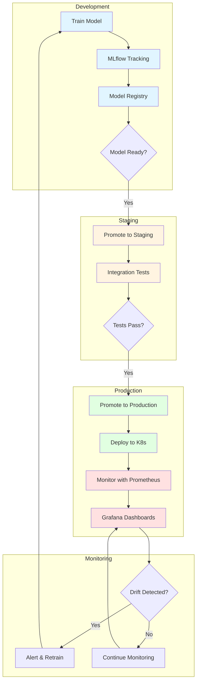
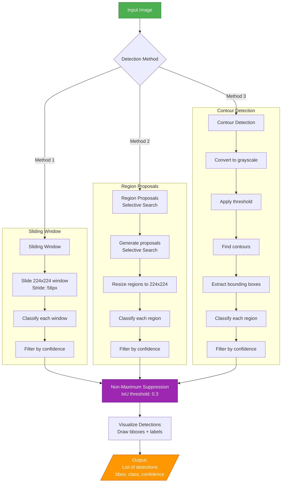

# ML Geometry Detector - Production MLOps System

Advanced Machine Learning system with complete MLOps pipeline for detection and classification of geometric shapes using Deep Learning architectures.

## Features

### Core ML Capabilities
- **Synthetic Dataset Generation**: Automated creation of training datasets with 10 geometric shapes
- **Custom CNN Architecture**: Convolutional neural network with ResNet blocks and SE-Net attention
- **Transfer Learning Support**: EfficientNet, ResNet, MobileNet pretrained models
- **Advanced Data Augmentation**: Albumentations pipeline for robust generalization
- **Multi-Object Detection**: Sliding window, region proposals, contour detection methods
- **REST API**: FastAPI server for real-time predictions with batch support

### MLOps Production Features
- **Model Registry**: Version control and lifecycle management (development → staging → production)
- **Experiment Tracking**: MLflow integration for tracking all training runs
- **Model Monitoring**: Prometheus metrics, drift detection, performance tracking
- **CI/CD Pipeline**: GitHub Actions for automated testing, building, and deployment
- **Containerization**: Docker and Docker Compose for reproducible environments
- **Orchestration**: Kubernetes deployment with horizontal pod autoscaling
- **Observability**: Grafana dashboards for real-time monitoring

## Quick Start

### Basic Installation

```bash
# Clone repository
git clone https://github.com/marcosotomac/ml-geometry.git
cd ml-geometry

# Create virtual environment
python -m venv venv
source venv/bin/activate  # Windows: venv\Scripts\activate

# Install dependencies
pip install -r requirements.txt
```

### MLOps Setup

```bash
# Install MLOps dependencies
pip install -r requirements-mlops.txt

# Start MLOps stack with Docker
docker-compose up -d

# Access services:
# - API: http://localhost:8000
# - MLflow: http://localhost:5000
# - Prometheus: http://localhost:9090
# - Grafana: http://localhost:3000
```

## Documentation

- **[MLOPS.md](MLOPS.md)**: Complete MLOps implementation guide
- **[MLOPS_SUMMARY.md](MLOPS_SUMMARY.md)**: MLOps features summary
- **[QUICKSTART_MLOPS.md](QUICKSTART_MLOPS.md)**: Quick start for MLOps
- **[QUICKSTART.md](QUICKSTART.md)**: Getting started tutorial
- **[API Documentation](http://localhost:8000/docs)**: Interactive API documentation

## MLOps Workflow



## Quick Commands

```bash
# Development
make install          # Install all dependencies
make train           # Train model with MLOps

# Docker
make docker-stack    # Start full MLOps stack

# Deployment
python deploy_model.py --model-name custom --version 1.0.0 --source-stage staging

# Monitoring
make mlflow          # Open MLflow UI (http://localhost:5000)
make grafana         # Open Grafana (http://localhost:3000)

# Testing
make test           # Run all tests
make lint           # Check code quality
```

## Supported Shapes

- Circle
- Square
- Rectangle
- Triangle
- Pentagon
- Hexagon
- Octagon
- Star
- Rhombus
- Ellipse

## Usage

### Training with MLOps

```bash
# Train with experiment tracking and model registry
python train_mlops.py \
  --model-type custom \
  --experiment-name ml-geometry \
  --register-model \
  --model-version 1.0.0 \
  --stage development
```

### Model Deployment Pipeline

```bash
# 1. Promote to staging
python deploy_model.py \
  --model-name custom \
  --version 1.0.0 \
  --source-stage development

# 2. Deploy to production
python deploy_model.py \
  --model-name custom \
  --version 1.0.0 \
  --source-stage staging

# 3. Deploy to Kubernetes
kubectl apply -f k8s/deployment.yaml
```

### Dataset Generation
```python
from src.data.dataset_generator import GeometricShapeGenerator

generator = GeometricShapeGenerator(img_size=224, shapes_per_class=1000)
### Dataset Generation

```python
from src.data.dataset_generator import GeometricShapeGenerator

generator = GeometricShapeGenerator(img_size=224, shapes_per_class=1000)
generator.generate_dataset('data/synthetic')
```

### Model Training

```python
from src.models.train import train_model

train_model(
    data_dir='data/synthetic',
    model_type='custom_cnn',
    epochs=50,
    batch_size=32
)
```

### Predictions

```python
from src.models.predictor import ShapePredictor

predictor = ShapePredictor('models/best_model.h5')
prediction = predictor.predict('path/to/image.jpg')
print(f"Shape: {prediction['class']}, Confidence: {prediction['confidence']:.2%}")
```

### API Server

```bash
python src/api/main.py
```

Access interactive documentation at http://localhost:8000/docs

## Workflow Diagram

### Complete ML Pipeline

```mermaid
graph TB
    Start([Start]) --> DataGen[Data Generation]
    
    subgraph "1. Dataset Creation"
        DataGen --> GenShapes[Generate 10 Shape Classes<br/>1000 samples per class]
        GenShapes --> Augment[Apply Augmentation<br/>Rotation, Flip, Noise, etc.]
        Augment --> Split[Train/Val/Test Split<br/>70% / 15% / 15%]
        Split --> SaveData[(data/synthetic/)]
    end
    
    SaveData --> DataLoad[Data Loading]
    
    subgraph "2. Data Preprocessing"
        DataLoad --> Normalize[Normalize Images<br/>0-1 range]
        Normalize --> Batch[Create Batches<br/>Default: 32]
        Batch --> RuntimeAug[Runtime Augmentation<br/>Train only]
    end
    
    RuntimeAug --> ModelChoice{Choose Architecture}
    
    subgraph "3. Model Creation"
        ModelChoice -->|Option 1| CustomCNN[Custom CNN<br/>ResNet + Attention]
        ModelChoice -->|Option 2| LightCNN[Lightweight CNN<br/>Fast Training]
        ModelChoice -->|Option 3| Transfer[Transfer Learning<br/>EfficientNet/ResNet]
        
        CustomCNN --> ModelBuild[Build Model<br/>Input: 224x224x3<br/>Output: 10 classes]
        LightCNN --> ModelBuild
        Transfer --> ModelBuild
    end
    
    ModelBuild --> Train[Training Pipeline]
    
    subgraph "4. Training"
        Train --> Compile[Compile Model<br/>Optimizer: Adam/SGD<br/>Loss: CrossEntropy]
        Compile --> Callbacks[Setup Callbacks<br/>Early Stop, Checkpoint<br/>LR Scheduler, TensorBoard]
        Callbacks --> Epochs[Train Epochs<br/>50-100 iterations]
        Epochs --> SaveModel[(Save Model<br/>models/saved_models/)]
    end
    
    SaveModel --> Eval[Evaluation]
    
    subgraph "5. Evaluation"
        Eval --> Predict[Generate Predictions<br/>Test Set]
        Predict --> Metrics[Calculate Metrics<br/>Accuracy, Precision<br/>Recall, F1-Score]
        Metrics --> Viz[Create Visualizations<br/>Confusion Matrix<br/>ROC Curves]
        Viz --> SaveResults[(results/)]
    end
    
    SaveResults --> Deploy{Deployment Option}
    
    subgraph "6. Deployment"
        Deploy -->|Option A| DirectPred[Direct Prediction<br/>ShapePredictor]
        Deploy -->|Option B| API[REST API<br/>FastAPI Server]
        Deploy -->|Option C| MultiDet[Multi-Object Detection<br/>Sliding Window/Contours]
        
        DirectPred --> Output[/Output: Class + Confidence/]
        API --> Output
        MultiDet --> Output
    end
    
    Output --> End([End])
    
    style Start fill:#4CAF50,stroke:#2E7D32,color:#fff
    style End fill:#4CAF50,stroke:#2E7D32,color:#fff
    style SaveData fill:#2196F3,stroke:#1565C0,color:#fff
    style SaveModel fill:#2196F3,stroke:#1565C0,color:#fff
    style SaveResults fill:#2196F3,stroke:#1565C0,color:#fff
    style Output fill:#FF9800,stroke:#E65100,color:#fff
```



### Inference Flow

```mermaid
graph LR
    A[Input Image<br/>Any Size] --> B[Preprocessing]
    
    subgraph Preprocessing
        B --> B1[Resize to 224x224]
        B1 --> B2[Normalize 0-1]
        B2 --> B3[Convert to Tensor]
    end
    
    B3 --> C[Model Forward Pass]
    
    subgraph "Model Inference"
        C --> C1[Feature Extraction<br/>Conv Layers]
        C1 --> C2[Channel Attention<br/>SE-Net]
        C2 --> C3[Classification Head<br/>Dense + Softmax]
    end
    
    C3 --> D[Post-processing]
    
    subgraph "Output Processing"
        D --> D1[Apply Softmax]
        D1 --> D2[Get ArgMax<br/>Predicted Class]
        D2 --> D3[Extract Confidence]
    end
    
    D3 --> E[/Output<br/>Class Name<br/>Confidence Score<br/>All Probabilities/]
    
    style A fill:#4CAF50,stroke:#2E7D32,color:#fff
    style E fill:#FF9800,stroke:#E65100,color:#fff
```



### Multi-Object Detection Pipeline



## Model Architecture

```
ml-geometry/
├── data/
│   ├── synthetic/       # Dataset generado
│   └── real/            # Imágenes reales (opcional)
├── models/
│   ├── saved_models/    # Modelos entrenados
│   └── checkpoints/     # Checkpoints de entrenamiento
├── src/
│   ├── data/            # Generación y procesamiento de datos
│   ├── models/          # Arquitecturas y entrenamiento
│   ├── evaluation/      # Métricas y visualizaciones
│   └── api/             # API REST
├── notebooks/           # Jupyter notebooks para experimentación
├── tests/               # Tests unitarios
└── configs/             # Archivos de configuración
## Model Architecture

### Custom CNN Architecture

The model follows a hierarchical structure with four main stages:

**Input Layer**
- Input shape: 224x224x3 (RGB images)

**Initial Convolution**
- Conv2D: 7x7 kernel, 64 filters, stride 2
- Batch Normalization + ReLU activation
- MaxPooling: 3x3, stride 2

**Stage 1** (Output: 56x56x64)
- 2x ResNet blocks with 64 filters
- Channel Attention mechanism
- Skip connections for residual learning

**Stage 2** (Output: 28x28x128)
- 3x ResNet blocks with 128 filters
- Downsampling via stride 2
- Channel Attention mechanism

**Stage 3** (Output: 14x14x256)
- 4x ResNet blocks with 256 filters
- Downsampling via stride 2
- Channel Attention mechanism

**Stage 4** (Output: 7x7x512)
- 3x ResNet blocks with 512 filters
- Downsampling via stride 2
- Channel Attention mechanism

**Classification Head**
- Global Average Pooling
- Dense layer: 512 units + ReLU + Dropout (0.3)
- Dense layer: 256 units + ReLU + Dropout (0.15)
- Output layer: 10 units + Softmax

### ResNet Block Structure

Each ResNet block contains:
- Conv2D (3x3) + BatchNorm + ReLU
- Conv2D (3x3) + BatchNorm
- Skip connection (identity or 1x1 conv for dimension matching)
- Addition + ReLU + Dropout
- L2 regularization (1e-4)

### Channel Attention (SE-Net)

- Global Average Pooling across spatial dimensions
- Dense layer with reduction (filters / 16)
- ReLU activation
- Dense layer to original filter size
- Sigmoid activation
- Element-wise multiplication with input

### Regularization Techniques

- **Dropout**: 0.3 in residual blocks, 0.15 in classification head
- **L2 Weight Decay**: 1e-4 on all convolutional and dense layers
- **Batch Normalization**: After each convolution for training stability
- **Data Augmentation**: Rotation, shifts, flips, zoom, brightness, contrast

### Transfer Learning Models

Available pretrained architectures:

**EfficientNet B0/B3**
- Compound scaling method (depth, width, resolution)
- Mobile inverted bottleneck convolutions
- Optimal efficiency-accuracy tradeoff

**ResNet50/101**
- Deep residual learning framework
- 50/101 layers with skip connections
- Proven performance on ImageNet

**MobileNetV2/V3**
- Depthwise separable convolutions
- Inverted residuals with linear bottlenecks
- Optimized for mobile and embedded devices

All transfer learning models include:
- Pretrained ImageNet weights (1000 classes)
- Custom classification head: 512 → 256 → num_classes
- Batch Normalization in classification head
- Optional fine-tuning of last N layers

## Project Structure

```
ml-geometry/
├── data/
│   ├── synthetic/       # Generated dataset
│   └── real/            # Real images (optional)
├── models/
│   ├── saved_models/    # Trained models
│   └── checkpoints/     # Training checkpoints
├── src/
│   ├── data/            # Data generation and processing
│   ├── models/          # Model architectures and training
│   ├── evaluation/      # Metrics and visualizations
│   └── api/             # REST API
├── notebooks/           # Jupyter notebooks
├── tests/               # Unit tests
└── configs/             # Configuration files
```

## Performance Metrics

Expected performance with default configuration:
- Training Accuracy: ~98-99%
- Validation Accuracy: ~95-97%
- Test Accuracy: ~95-97%

Transfer learning models typically achieve 1-2% higher accuracy.

## Advanced Features

### Multi-Object Detection

```python
from src.evaluation.multi_detector import MultiShapeDetector

detector = MultiShapeDetector('models/best_model.h5')
detections = detector.detect_shapes_contours(image, confidence_threshold=0.7)
```

### Custom Training Parameters

```bash
python train_model.py \
    --model_type transfer \
    --base_model efficientnet_b0 \
    --epochs 100 \
    --batch_size 16 \
    --learning_rate 0.001 \
    --dropout_rate 0.3
```

## API Endpoints

- `GET /health` - Health check
- `POST /predict` - Single image prediction
- `POST /predict/batch` - Batch prediction
- `GET /classes` - List available classes
- `GET /model/info` - Model information

## Contributing

Contributions are welcome. Please open an issue or pull request.

## License

MIT License

## Author

Marcos Soto Maceda
